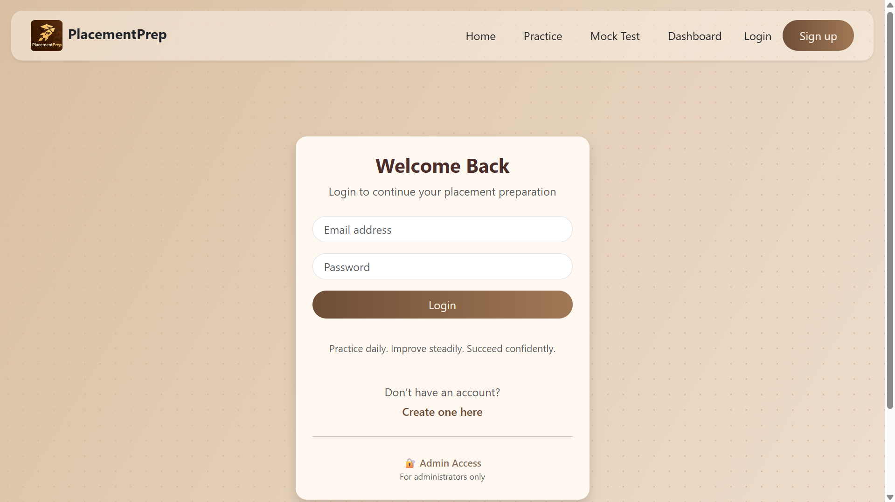
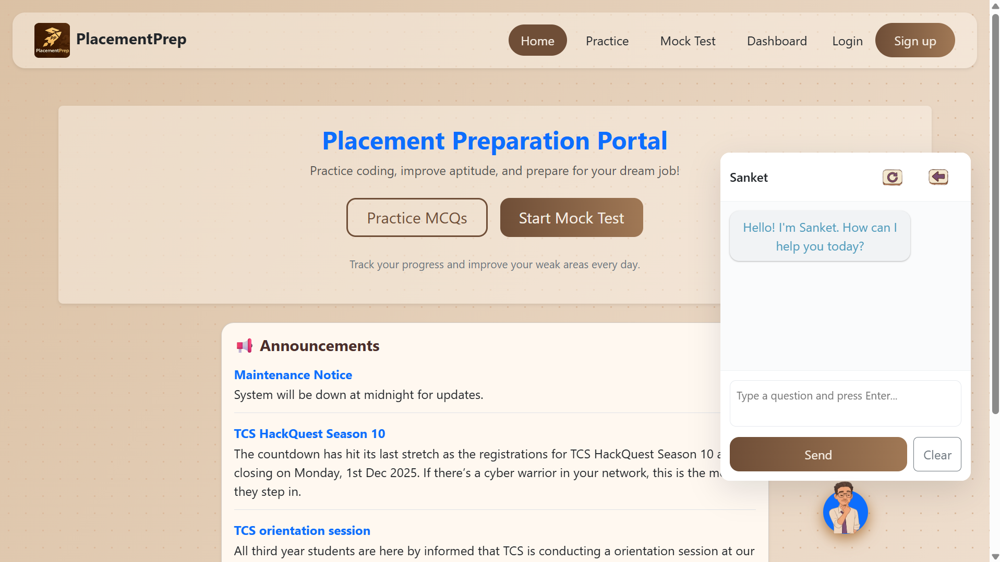
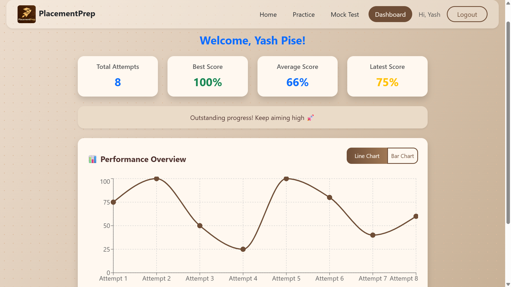
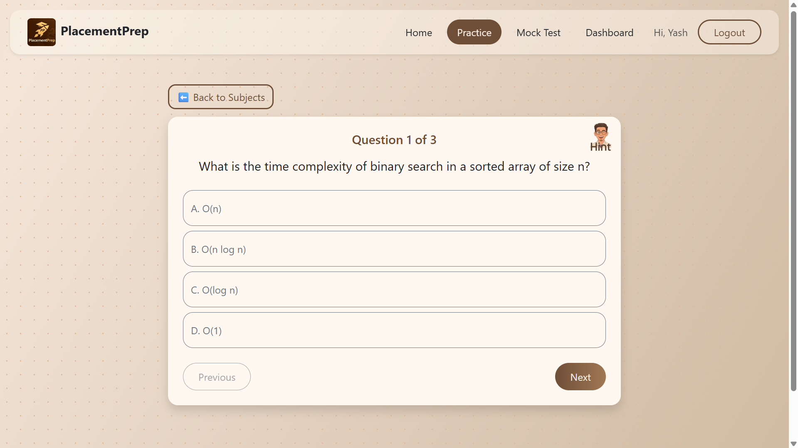
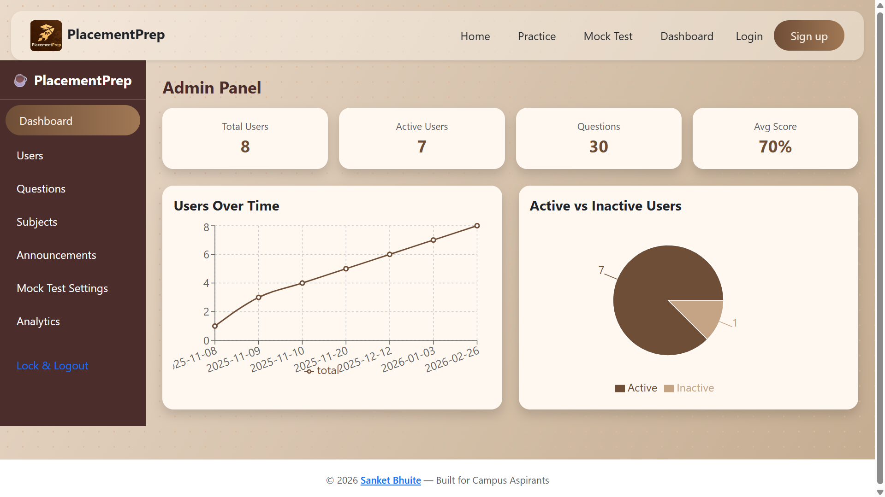

# 📌 PlacementPrep

PlacementPrep is a full-stack placement preparation platform that helps students practice aptitude questions, take mock tests, and prepare for technical interviews.

---

## 🚀 Features

* 🧠 Practice MCQ questions
* 📝 Mock test environment
* 🔐 Login / Signup authentication
* 📊 Dashboard with progress
* 🤖 AI Chatbot
* 👨‍💼 Admin panel
* ⏱️ Timed tests
* 📱 Responsive UI

---

## 📸 Screenshots

<table>
<tr>
<td align="center"><b>🔐 Login Page</b></td>
<td align="center"><b>🏠 Home Page</b></td>
</tr>
<tr>
<td>
<br/>
User authentication interface with secure login, signup navigation, and admin access option.
</td>
<td>
<br/>
Landing page displaying platform overview with STUDY CHATBOT, announcements by Admin, navigation menu, and quick access to practice and mock tests.
</td>
</tr>

<tr>
<td align="center"><b>📊 Dashboard</b></td>
<td align="center"><b>📝 Practice</b></td>
</tr>
<tr>
<td>
<br/>
User dashboard showing progress tracking, test performance over time graph and also chart, and quick navigation to modules.
</td>
<td>
<br/>
Practice section for solving aptitude and technical MCQs over 20 subjects with instant feedback.
</td>
</tr>

<tr>
<td align="center"><b>🔐 Admin Page</b></td>
<td align="center"></td>
</tr>
<tr>
<td>
<br/>
Admin panel for managing questions, users, and mock test configurations.
</td>
<td></td>
</tr>
</table>

## 🛠️ Tech Stack

### Frontend

* React (Vite)
* Bootstrap
* Context API

### Backend

* Spring Boot
* REST APIs

### Other

* JSON data storage
* Node mock server

---

## 📂 Project Structure

```
PlacementPrep
│
├── frontend
│   ├── src
│   ├── public
│   └── package.json
│
├── backend
│
└── README.md
```

---

## ⚙️ Installation & Setup

### 1. Clone repository

```
git clone https://github.com/sanketbhuite/PlacementPrep.git
cd PlacementPrep
```

### 2. Run Frontend

```
cd frontend
npm install
npm run dev
```

Frontend runs on:
http://localhost:5173

### 3. Run Backend

Run Spring Boot application:

```
cd backend
mvn spring-boot:run
```

Backend runs on:
http://localhost:8080

---

## 🎯 Use Cases

* Campus placement preparation
* Aptitude practice
* Mock interview preparation
* Technical test simulation

---

## 👨‍💻 Author

Sanket Bhuite
* GitHub: [sanketbhuite](https://github.com/sanketbhuite/)
* Portfolio: [Myself.Sanket](https://myself-sanket.netlify.app/)
* LinkedIn: [sanketbhuite](https://www.linkedin.com/in/sanketbhuite/)

---

## ⭐ Support

Give this project a star if you like it.

---

## 📄 License

MIT License
